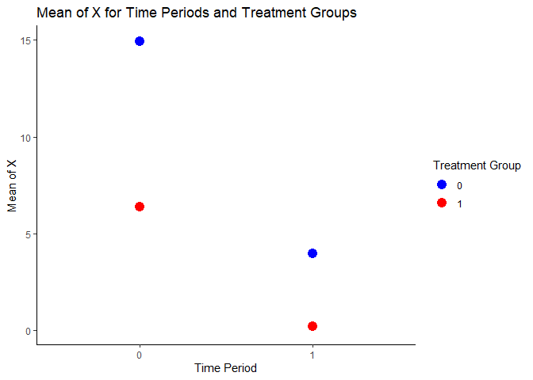

# boundid

The **boundid** package accompanies the paper “Going Through the Roof:
Difference-in-Differences Designs in Contexts of Natural Boundaries” by
Ludwig Schulze and Joris Frese. In this paper, we discuss parallel
trends violations in difference-in-differences estimations where treated
units are unable to follow the counterfactual control trend
post-treatment due to natural boundaries to the scale of the outcome
variable.

The goal of the **boundid** package is to quantify the bias resulting
from this parallel trends violation and account for it with various
trimming- and weighting-based methods. The package is built around two
complementary functions: **boundid_test**, and **boundid_adjust**.

## Installation

You can install the development version of boundid like so:

``` r
devtools::install_github("fresej/boundid")
```

## boundid_test

The **boundid_test** function is used to evaluate (the extent of)
boundary bias in a difference-in-differences setup. It contains the
following parameters:

**Data**: An R dataframe.

**X_var**: The outcome variable.

**threshold**: The natural boundary of the outcome.

**floor**: A logical statement. Should be set to TRUE if the boundary is
a floor, or to FALSE if the boundary is a ceiling. Default is TRUE.

**treatment**: The treatment variable.

**time**: The time variable.

**ID**: The unit ID.

**first_period**: A numeric value indicating the first time period in
which the treatment is administered.

**S**: A numeric value indicating the counterfactual fall. If NULL, the
function automatically computes the counterfactual fall of the control
group.

**more_info**: A logical statement. If TRUE, then additional information
is included in the output, such as the distance of the furthest unit
above or below the boundary (or the distance of the 1st percentile):

**stag**: A logical statement. Should be TRUE if the design is staggered
or FALSE for a basic 2x2 DiD.

The **output** of this function is a console output containing
information about the extent of boundary bias, including, but not
limited to, the pre-treatment means of the control and the treatment
group, the trend of the control group (which is the counterfactual trend
for the treatment group), the number of observations in the treatment
group going below the natural boundary if they follow the counterfactual
trend, the treatment group post-treatment means with and without natural
boundaries after following the counterfactual trend, and a t-test of the
difference between those two means.

## boundid_adjust

The **boundid_adjust** function is used to prepare weighting or trimming
parameters before the DiD estimation step to counteract boundary bias.
In the weighting approach, these weights take on values between 0 and 1.
In the trimming approach, these weights take on either the value 0 or
the value 1. The function contains the following parameters:

**Data**: An R dataframe.

**X_var**: The outcome variable.

**threshold**: The natural boundary of the outcome.

**floor**: A logical statement. Should be set to TRUE if the boundary is
a floor, or to FALSE if the boundary is a ceiling. Default is TRUE.

**treatment**: The treatment variable.

**time**: The time variable.

**ID**: The unit ID.

**group2_mean**: A numeric value indicating the pre-treatment mean of
the treatment group.

**ATU**: A logical statement. TRUE if the ATU is the target estimand.

**ATT**: A logical statement. TRUE if the ATT is the target estimand.

**S**: A numeric value indicating the counterfactual fall. If NULL, the
function automatically computes the counterfactual fall of the control
group.

**cut**: A logical statement. If TRUE, then the cutting/trimming
approach will be used. If FALSE, then the weighting approach will be
used.

**panel**: A logical statement. If TRUE, then the function generates
weights for the whole panel. If FALSE, then the function generates
weights for two time periods.

The **output** of this function is a vector containing the newly
generated weights to be included in the estimation step to counter-act
boundary bias.

## Example

This is a basic example using simulated data to demonstrate how to use
the boundid_test and boundid_adjust functions in the boundid package to
estimate boundary bias and adjust for it with the weighting and the
trimming approach in a classic 2x2 DiD setup:

``` r
library(boundid)
library(tidyverse)
#> Warning: Paket 'tidyverse' wurde unter R Version 4.2.3 erstellt
#> Warning: Paket 'ggplot2' wurde unter R Version 4.2.3 erstellt
#> Warning: Paket 'tibble' wurde unter R Version 4.2.3 erstellt
#> Warning: Paket 'tidyr' wurde unter R Version 4.2.3 erstellt
#> Warning: Paket 'readr' wurde unter R Version 4.2.3 erstellt
#> Warning: Paket 'purrr' wurde unter R Version 4.2.3 erstellt
#> Warning: Paket 'dplyr' wurde unter R Version 4.2.3 erstellt
#> Warning: Paket 'stringr' wurde unter R Version 4.2.3 erstellt
#> Warning: Paket 'forcats' wurde unter R Version 4.2.3 erstellt
#> Warning: Paket 'lubridate' wurde unter R Version 4.2.3 erstellt
#> ── Attaching core tidyverse packages ──────────────────────── tidyverse 2.0.0 ──
#> ✔ dplyr     1.1.1     ✔ readr     2.1.5
#> ✔ forcats   1.0.0     ✔ stringr   1.5.0
#> ✔ ggplot2   3.5.0     ✔ tibble    3.2.1
#> ✔ lubridate 1.9.3     ✔ tidyr     1.3.0
#> ✔ purrr     1.0.1     
#> ── Conflicts ────────────────────────────────────────── tidyverse_conflicts() ──
#> ✖ dplyr::filter() masks stats::filter()
#> ✖ dplyr::lag()    masks stats::lag()
#> ℹ Use the conflicted package (<http://conflicted.r-lib.org/>) to force all conflicts to become errors
library(fixest)
#> Warning: Paket 'fixest' wurde unter R Version 4.2.3 erstellt

# Data simulation
set.seed(123)
n <- 500

time_1 <- data.frame(
  ID = 1:n,
  X = rnorm(n, mean = 10, sd = 3)
)

time_2 <- data.frame(
  ID = 1:n,
  X = rnorm(n, mean = 7, sd = 3)
)

simulated_data_1 <- rbind(
  cbind(time_1, time = 0),  
  cbind(time_2, time = 1)  
)

simulated_data_1$treated <- 0

time_3 <- data.frame(
  ID = (n+1):(2*n),
  X = rnorm(n, mean = 6, sd = 3)
)

time_4 <- data.frame(
  ID = (n+1):(2*n),
  X = rnorm(n, mean = 6, sd = 3)
)

simulated_data_2 <- rbind(
  cbind(time_3, time = 0), 
  cbind(time_4, time = 1)  
)

simulated_data_2$treated <- 1

simulated_data <- rbind(simulated_data_1, simulated_data_2)

simulated_data <- simulated_data %>% 
  arrange(ID, time)

means <- simulated_data %>%
  group_by(time, treated) %>%
  summarise(mean_X = mean(X, na.rm = TRUE))
#> `summarise()` has grouped output by 'time'. You can override using the
#> `.groups` argument.

ggplot(means, aes(x = factor(time), y = mean_X, color = factor(treated))) +
  geom_point(size = 3) +
  labs(title = "Mean of X for Time Periods and Treatment Groups",
       x = "Time Period", y = "Mean of X", color = "Treatment Group") +
  scale_color_manual(values = c("blue", "red")) +
  theme_minimal()
```



``` r

# run test
boundid_test(simulated_data, "X", 0, floor = T, simulated_data$treated, simulated_data$time, 
             more_info = T, ID = "ID")
#> Difference between restricted and unrestricted mean:
#> 
#> Control Group Pre-Treatment  Mean:  10.10377 
#> Treatment Group Pre-Treatment  Mean:  6.078602 
#> Counterfactual Trend:  -3.110775 
#> 
#> Values below boundary: 84 
#> Counterfactual Mean with boundary:  3.219379 
#> Counterfactual Mean without boundary:  2.967827 
#> Absolute Difference:  0.2515519 
#> 
#> Two Sample t-test Results:
#> p-value:  0.1539285 
#> t-statistic:  -1.426876 
#> degrees of freedom:  998 
#> confidence interval:  -0.5975044 0.09440066 
#> 
#> Full Distance to 0: -5.196764 
#> (1st Percentile) Distance to 0: -3.633893

# create weights
test_weights <- boundid_adjust(simulated_data, "X", 0, floor = T,treatment = simulated_data$treated, 
                               time = simulated_data$time, ID = simulated_data$ID, ATT = T, 
                               cut = F, panel = F,orig_ID = simulated_data$ID)

# cut observations
test_cuts <- boundid_adjust(simulated_data, "X", 0, floor = T,treatment = simulated_data$treated, 
                            time = simulated_data$time, ID = simulated_data$ID, ATT = T, cut = T, 
                            panel = F,orig_ID = simulated_data$ID)


table(test_weights)
#> test_weights
#> 2.71495953072795e-06 6.49144543584053e-06 1.71355977827756e-05 
#>                  590                    2                    2 
#> 5.63006747188558e-05 7.04793068267914e-05 8.89591194538106e-05 
#>                    2                    2                    2 
#>  0.00012989141858235 0.000134184184669009 0.000156952050092376 
#>                    2                    2                    2 
#> 0.000211354169893024   0.0002810238297593  0.00032627274219875 
#>                    2                    2                    2 
#> 0.000348118397779973  0.00035187278947451 0.000461144595513691 
#>                    2                    2                    2 
#> 0.000469199175571553 0.000493589354173754 0.000569915670667738 
#>                    2                    2                    2 
#> 0.000570555408161083 0.000650634769792425 0.000789400597475051 
#>                    2                    2                    2 
#> 0.000798632808772512 0.000800206304360778 0.000852556794245024 
#>                    2                    2                    2 
#> 0.000931931979049076 0.000958801078956657 0.000965692583611099 
#>                    2                    2                    2 
#> 0.000974422782314986 0.000975192467441748 0.000992181050112217 
#>                    2                    2                    2 
#>  0.00101067955415247  0.00107823384880945  0.00113013404752009 
#>                    2                    2                    2 
#>    0.001143316917403  0.00115919292928067  0.00116676750286313 
#>                    2                    2                    2 
#>  0.00120103529847356  0.00120284724716758   0.0012064472575353 
#>                    2                    2                    2 
#>  0.00126442770948869  0.00127854731068519  0.00136896555588434 
#>                    2                    2                    2 
#>  0.00144894720078791  0.00145386419037244  0.00147252347569993 
#>                    2                    2                    2 
#>  0.00151431827563201  0.00154976305032799  0.00161176833132516 
#>                    2                    2                    2 
#>  0.00162298968882851  0.00165266266513242  0.00168600480869133 
#>                    2                    2                    2 
#>  0.00169263985345939  0.00172066544750188  0.00178015474567695 
#>                    2                    2                    2 
#>  0.00179996551352917  0.00182182107611895  0.00184159556214169 
#>                    2                    2                    2 
#>  0.00188707242716102   0.0019126824863269  0.00196851812151295 
#>                    2                    2                    2 
#>  0.00197746348806301   0.0020136523813592  0.00201874395618817 
#>                    2                    2                    2 
#>  0.00202225491047344  0.00208347953673407  0.00210502231547456 
#>                    2                    2                    2 
#>  0.00210594677741766  0.00220778246899209   0.0022452359738901 
#>                    2                    2                    2 
#>  0.00225853990664152  0.00231778786776027  0.00237635762495245 
#>                    2                    2                    2 
#>  0.00249841769506812  0.00250258871945268  0.00253693702642729 
#>                    2                    2                    2 
#>  0.00254731832620683  0.00262123754977863  0.00263391265294404 
#>                    2                    2                    2 
#>  0.00263697511471537  0.00264005241279082  0.00264009586216432 
#>                    2                    2                    2 
#>  0.00264715457447771  0.00266287447813456  0.00275190812769978 
#>                    2                    2                    2 
#>  0.00278997486971287  0.00283179246266893  0.00284103539768171 
#>                    2                    2                    2 
#>  0.00291262383761475  0.00301544504938656  0.00303669216507795 
#>                    2                    2                    2 
#>  0.00308740249134502  0.00313155782168961  0.00316422697314817 
#>                    2                    2                    2 
#>   0.0031785434212044  0.00321489102216676  0.00330990195201842 
#>                    2                    2                    2 
#>  0.00347357139687957  0.00348213725169483  0.00353178162023049 
#>                    2                    2                    2 
#>  0.00360507673083705  0.00363920111814418   0.0036481378148347 
#>                    2                    2                    2 
#>  0.00368397664528963  0.00369862141772898  0.00370787131115268 
#>                    2                    2                    2 
#>  0.00373112996664381   0.0037419619728725  0.00378513540814867 
#>                    2                    2                    2 
#>  0.00385655536214562  0.00387736952704539  0.00396151041375353 
#>                    2                    2                    2 
#>  0.00412052952539644   0.0041753114517435  0.00420027297944712 
#>                    2                    2                    2 
#>  0.00422768313601275   0.0042278249381254  0.00453062319392294 
#>                    2                    2                    2 
#>   0.0046805319896445  0.00479769552450723  0.00485371204770283 
#>                    2                    2                    2 
#>  0.00500295259375993  0.00501893004096099  0.00533892060036265 
#>                    2                    2                    2 
#>  0.00538983799181464  0.00540514837401075  0.00543586094501845 
#>                    2                    2                    2 
#>  0.00551173954513394  0.00560181013466659  0.00573890335120948 
#>                    2                    2                    2 
#>  0.00577057672877206  0.00583620867403858  0.00585651854615387 
#>                    2                    2                    2 
#>  0.00590999912288533  0.00593210593576882   0.0059732645632835 
#>                    2                    2                    2 
#>  0.00598716584788842  0.00599025234850053  0.00615890737835928 
#>                    2                    2                    2 
#>  0.00618363389169459  0.00620219032860281  0.00626377248318839 
#>                    2                    2                    2 
#>  0.00629710587207454   0.0063265108276827  0.00636823286459056 
#>                    2                    2                    2 
#>  0.00646140343369304  0.00648212084359269   0.0065059045155565 
#>                    2                    2                    2 
#>   0.0067068452399442  0.00679933890859759  0.00681205060497857 
#>                    2                    2                    2 
#>  0.00681822666125493  0.00704438230037967  0.00716910654549525 
#>                    2                    2                    2 
#>  0.00719099950996267  0.00743026735482652  0.00754555498520742 
#>                    2                    2                    2 
#>  0.00758091766432187  0.00765671323984218  0.00771138925035853 
#>                    2                    2                    2 
#>  0.00772255541745228  0.00772646593381995  0.00775891576169248 
#>                    2                    2                    2 
#>  0.00776139945298361  0.00790458339747139  0.00792173900578817 
#>                    2                    2                    2 
#>  0.00809791626208234  0.00814397525721726  0.00818796188123449 
#>                    2                    2                    2 
#>  0.00830523405047325  0.00839512269089385  0.00844830979867981 
#>                    2                    2                    2 
#>  0.00846136608263944  0.00849246994023973  0.00872397966577543 
#>                    2                    2                    2 
#>   0.0090443923025545  0.00908431402768478  0.00920843238768564 
#>                    2                    2                    2 
#>  0.00921669992922493  0.00960885342069904  0.00974399581435424 
#>                    2                    2                    2 
#>   0.0098614727386198   0.0100348358620076   0.0102526723836975 
#>                    2                    2                    2 
#>   0.0103738233960223   0.0105109091428564   0.0106159087505994 
#>                    2                    2                    2 
#>   0.0106196318948072   0.0107413733525321   0.0107448332911515 
#>                    2                    2                    2 
#>   0.0108838075747485   0.0111805391966778   0.0113769933726338 
#>                    2                    2                    2 
#>   0.0114013772097831   0.0116515410608233   0.0129584403737895 
#>                    2                    2                    2 
#>   0.0131521106147396   0.0133111745486377   0.0135928997838045 
#>                    2                    2                    2 
#>   0.0135937458973217   0.0136004920487631   0.0143742375806338 
#>                    2                    2                    2 
#>   0.0148733325996065     0.01549723455716    0.016658821141094 
#>                    2                    2                    2 
#>   0.0179725007090538   0.0181042301259881                    1 
#>                    2                    2                 1000

table(test_cuts)
#> test_cuts
#>    0    1 
#>  800 1200
```
